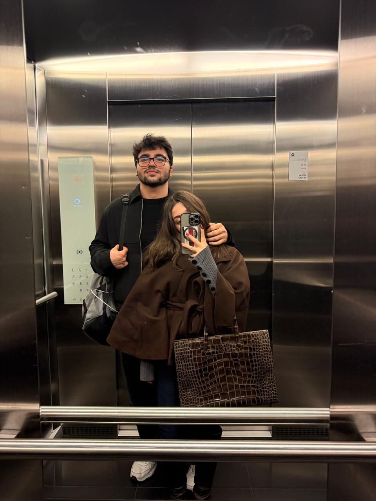
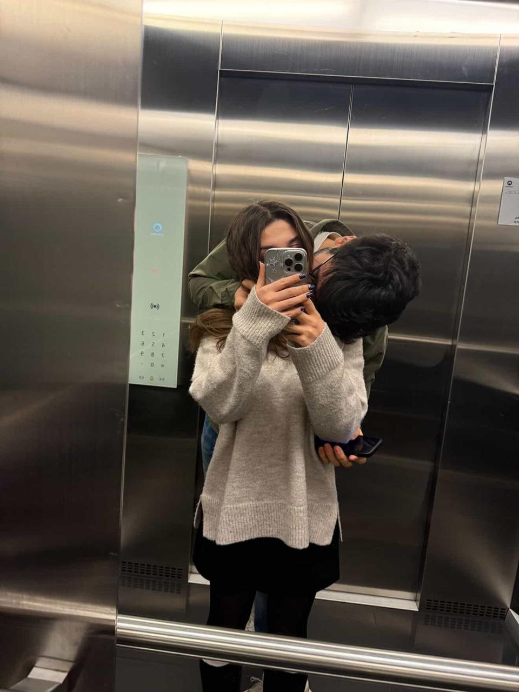

# 💌 VALENTINE'S SURPRISE WEBSITE - CUSTOMIZATION GUIDE

## Welcome! 🎉
This is your personalized Valentine's surprise website. Follow these steps to make it uniquely yours!

---

## 📋 STEP 1: Customize Questions and Answers

Open `script.js` and look for the `puzzleConfig` array (around line 4).

You'll see 10 questions with answers. Replace them with your own memories and inside jokes!

**Example:**
```javascript
{ id: 1, question: "Where did we first meet?", answer: "COFFEE SHOP", clues: [{ charIndex: 0, targetSlot: 2 }] },
```

**What to change:**
- `question`: The question to ask your girlfriend
- `answer`: The answer (use UPPERCASE)
- `charIndex`: Which letter in the answer (0 = first letter)
- `targetSlot`: Which slot number to fill in the password

**Tips:**
- Keep answers between 2-10 characters (or adjust PASSWORD_LENGTH if needed)
- Use meaningful memories or inside jokes
- Make clues challenging but fair!

---

## 🔐 STEP 2: Create Your Secret Password

Find this line in `script.js`:
```javascript
const TARGET_PASSWORD = "LOVEFOREVER";
const PASSWORD_LENGTH_WORD1 = 4;
```

**Change this to:**
- `TARGET_PASSWORD`: Your secret message (e.g., "ILOVE YOU" = 10 characters)
- `PASSWORD_LENGTH_WORD1`: How many characters before the space

**Example:**
```javascript
const TARGET_PASSWORD = "WILLYOUMARRY ME";
const PASSWORD_LENGTH_WORD1 = 9;
```

The clues from questions will guide her to fill in the password!

---

## 📸 STEP 3: Add Your Photos

The website expects 6 photos named:
- `foto1.jpg`
- `foto2.jpg`
- `foto3.jpg`
- `foto4.jpg`
- `foto5.jpg`
- `foto6.jpg`

**To add photos:**
1. Place your 6 couple photos in the same folder as `index.html`
2. Name them exactly as shown above (or change the names in `index.html`)
3. Recommended size: 320x400 pixels (portrait orientation)
4. File format: JPG, PNG, or WebP

**To rename photos in the HTML:**
Open `index.html` and find these lines:
```html


<!-- etc -->
```

---

## 💌 STEP 4: Customize The Love Letter

Open `index.html` and find the letter content (around line 89-104).

Replace this text with your own message:
```html
<h2>My Love,</h2>
<p>
    The fact that you answered all these questions correctly proves once again...
    <!-- Replace with your message -->
</p>
```

**Pro tips:**
- Use `<br>` for line breaks
- Use `<b></b>` for bold text
- Keep it heartfelt and personal!

---

## 🎨 STEP 5: Customize Colors (Optional)

Open `style.css` and find this section at the very top:
```css
:root {
    --primary: #e91e63;  /* Main color (pink) */
    --glass: #f48fb1;    /* Glass effect color */
    --bg-gradient: linear-gradient(135deg, #fce4ec 0%, #f8bbd0 100%);  /* Background */
}
```

**Change colors:**
- Use any hex color code (e.g., #FF5733, #3498DB)
- Search "color picker" online to find hex codes
- Popular options: Red (#FF0000), Blue (#0000FF), Purple (#9400D3)

---

## 🧪 STEP 6: Test Everything

1. Open `index.html` in a web browser
2. Click "START"
3. Try answering a question to make sure it's correct
4. Fill in the password - the clues should match
5. Click the envelope to open it
6. Click the letter to read your message
7. Check that all 6 photos appear and can be hovered

---

## ❓ Troubleshooting

### Password isn't unlocking?
- Make sure every character in the password is filled correctly
- Check that letter case matches (all UPPERCASE recommended)
- Verify clues point to the right password slots

### Photos not showing?
- Check that photo files are in the same folder as `index.html`
- Make sure filenames match exactly (including .jpg extension)
- Verify file permissions are correct

### Colors look wrong?
- Clear browser cache (Ctrl+Shift+Delete)
- Try a different browser
- Check hex color codes are valid

### Questions not appearing?
- Make sure you didn't accidentally delete commas in the array
- Check for typos in the syntax
- Reload the browser

---

## 🚀 How It Works

1. **Quiz Phase**: She answers 10 personalized questions
2. **Clues**: Correct answers reveal numbers that are clues
3. **Password**: Numbers tell her which letters go in which password slots
4. **Unlock**: Complete password opens the envelope
5. **Surprise**: Beautiful animations, photos scatter, and love letter appears!

---

## 💡 Advanced Tips

### Making questions harder:
- Don't give clues for all questions (leave some blank)
- Use questions only YOU two would know

### Making it easier:
- Add more clues
- Make the password shorter
- Use more obvious questions

### Adding more photos:
- Change the HTML to add more `` tags
- Update CSS for new photo scatter positions
- Modify `.p7`, `.p8` etc in the `.envelope-wrapper.open` styles

---

## 📞 Need Help?

If something breaks:
1. Check for typos in quotes and brackets
2. Make sure commas separate array items
3. Verify all HTML tags are closed properly
4. Look for red squiggly lines in your code editor

---

## 💑 Final Notes

- This website works best on modern browsers (Chrome, Firefox, Safari, Edge)
- Mobile support is included but desktop looks better
- Share the website by sending her the HTML file or uploading to a host
- The confetti and animations add extra magic! 🎉

**Make it personal, make it memorable, and most importantly - have fun creating this surprise!** ❤️
